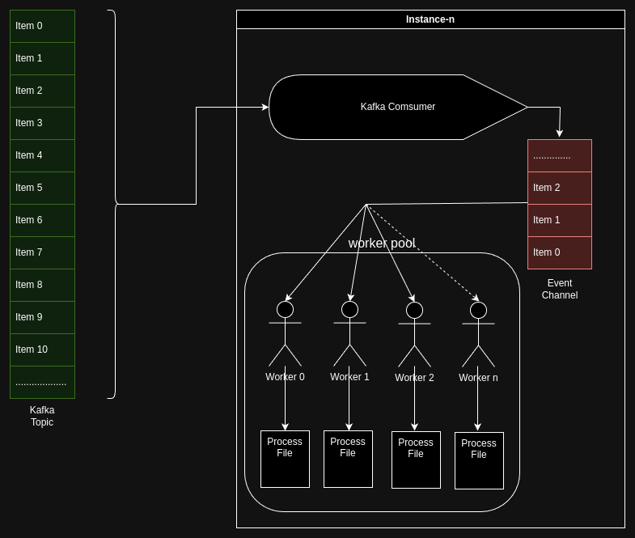

# Hangout Storage Service

## Description

This is a service used to process and store media content in the most optimized way possible so that it can be streamed to the Hangout app users effectively. Currently it contains the pipeline for video procesing and the implementation of image processing pipeline is underway.

In the final version this service will be able to process any image or video content effectively to optimize them for storage and streaming.

## Pre-requisites

- kafka Broker url and a topic to connect to
- FFMPEG & ImageMagick to be installed locally in the machine/node in which this service would run


## Architecture overview



In the service the main input comes in the form of kafka events. A single event maps to a single file uploaded by the user. Whenver the event occurs the consumer consumes the event then puts it in a channel. A pool of workers listen to that channel. Whenever a new event is put in the channel one of the available worker picks up the task and starts processing it.
The whole architecture aims to be very concurrent in nature to allow scaling up and down as needed.

## Code Walthrough

Let us dive deep ,we will go from the basic things to thigs of more complexiy.

1. Lets start with configuration. The different settings of the application can be configured through a single yaml file or environment variables or mix of both. 
    - you will find a yaml file under `resources` folder. 
    - Every entry in yaml file can be configured through environment variables also. You will find the name of the environment variables inside `config/config.go` file.
2. After the configuration is loaded, lets look at the loggers.
   - Here we have 2 implementations of logger namely `zerolog` & `slog`.
   - They are hidden behind a common interface.
   - The design of this logger packge is quite novel to me. I think we can publish that as a separate package.
   - You can switch the implementation of the logger backed that will be used in runtime using `log.backend` yaml config or `LOG_BACKEND` env variable. 
   - There are 2 acceptable values for this config. Namely `zerolog` and `slog`. If any other value is provided `zerolog` will be used as a default logging backend.
3. After that lets come to the Kafka consumers. 
    - Here we are using the very famous IBM Sarama library. 
    - Every instance will have a single kafka consumer that runs in its own go routine so that the main application flow is not blocked.
    - We are using the `ConsumerGroup` api to make kafka allocate & rebalance the topic partitions to be allocated to the consumer of the current instance.
    - This also means if we have multiple instances of this application. All the consumers will belong to the same consumer group.
    - As the partitions are allocated by kafka and the events are distributed in different partitions this prevents a race condition where multiple instances of this application will race to consume the same event and there by process the same file twice.
    - Topic names and the file upload path can be configured from the yaml file or env variables which ever is preffered.
    - The service expects the individual events the have this structure: 
        ```json
        {
            "key": "<HTTP contentType header value of the file>", 
            "body": "<filename with extension>"
        }
        ```
        `key` is the event key that you can provide while producing kafka events to a topic. And `body` is the event body
4.  Now we come to the workers. The number of workers in the worker pool can be configured using `hangout.worker-pool.strength` yaml property or the `HANGOUT_WORKER_POOL_STRENGTH` env variable. This can help in case you have a beefier machine you can increase the number of workers this would in turn mean more number of files can be processed oncurrently at any point of time.

5. There is a channel which links the kafka consumer and the workers. This is a buffered channel. 
    - The length of the buffered channel can be configured using `hangout.media.queue-length` yaml property or `HANGOUT_MEDIA_QUEUE_LENGTH` env variable. 
    - In case you have a low spec machine or an unreliable kafka connection you can increase the channel length so that you consume events as quickly as they come and then you keep them in your own buffer so that they are processed on as the worker becomes idle without any rush.
6. Lets get into the files package. There is a common interface called `File` that the workers call and both `Image` and `Video` pipelines can be intiated depending upon the value of the `key` field of the kafka event.

7. Lets go over the overall execution flow of the service:
    1. First all the values from the yaml file and the env variables are loaded.
    2. Then depending on the config, the suitable logger is initiated.
    3. Then the worker pool spawns the required number of workers and makes them available.
    4. Then the connection to Kafka is setup and the consumer joins the consumer group.
    5. The consumer remains active thorugh out the time the service runs. It runs parallely.
    6. Whenever there is an event in the topic, the consumer consumes it then sends it to the `eventChannel`.
    7. Every worker in the worker pool listens to this channel. As, the message consumption in go channels is blocking in nature only one of the idle worker picks up the event and starts processing the file. While the other idle workers in the pool keep listening for the next event to process. This enables us to process multiple events concurrently.
    8. If a situation occours an event comes and all the workers are busy processing previous files then the buffered nature of the channel comes into play and it holds some events in buffer whenever any of the worker becomes idle it will pickup the next event from buffer. This helps to eliviate some back pressure problems too.
    9. But if the channel becomes full too then the kafka consumer will no longer consume new events until there is space for a new event in the channel.
    10. Video processing and Image procesing pipelines are synchronous in nature so, the worker will be blocked until the file it is processing gets processed finishes fully or it erros out for some reason.
    11. When you shutdown the service it tries for graceful shutdown where all the workers and the consumers complete their ongoing work and then shut themselves down. So, shutdown doesn't necessarily stop and crash the service immedietly. If aany of the workers or the kafka consumer is idle they would shutdown immedietly but the worker which is busy will complete its work then shutdown.